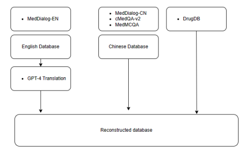
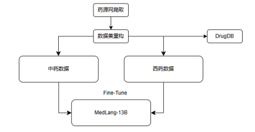
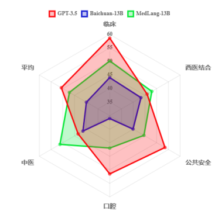
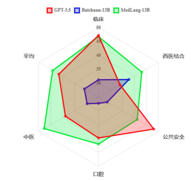
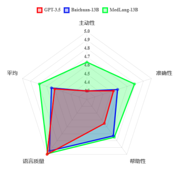
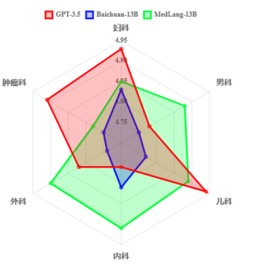
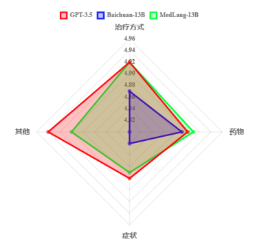

## MedLang-13B

基于Baichuan-13B的基础模型

##### 医疗数据集

##### DrugDB：./Drug-Info/

##### MedLang-13B：./MedLang-Model/

​														  	*MLEC-QA Few-shot评估*

​														  	*MLEC-QA Zero-shot评估*

​														  	        *cmb-clin评估*

​														  	                *cmd评估*

​														  	                 *cmid评估*

#####  Doctor-patient dialogue system:  ./MedLang-Chat/
